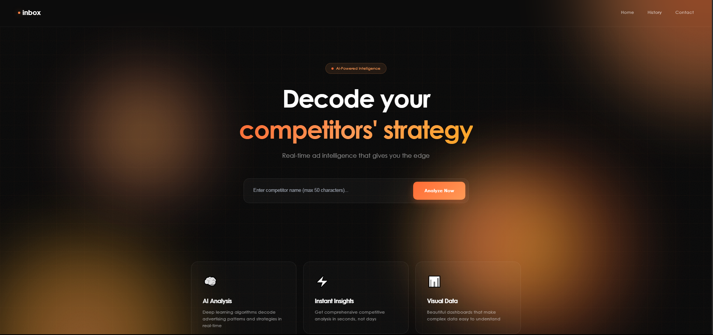
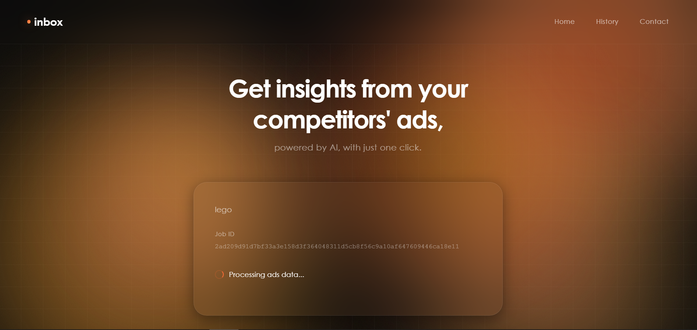
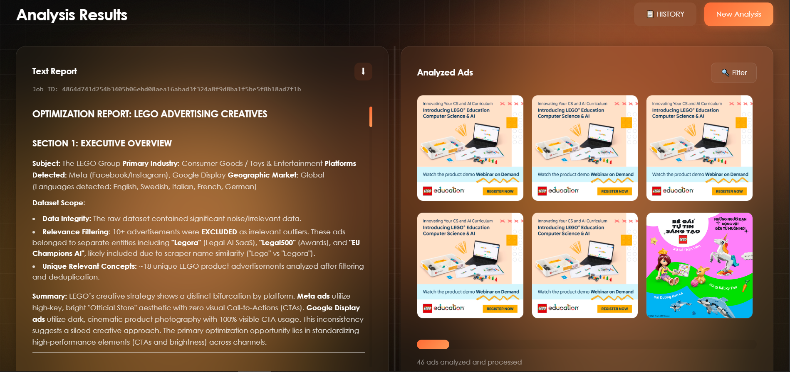
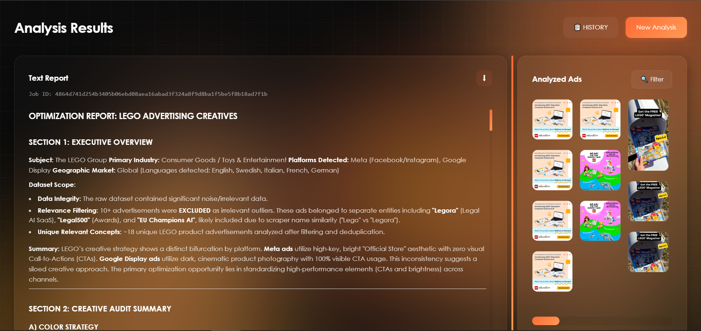
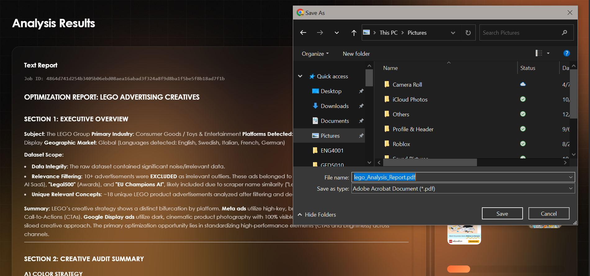
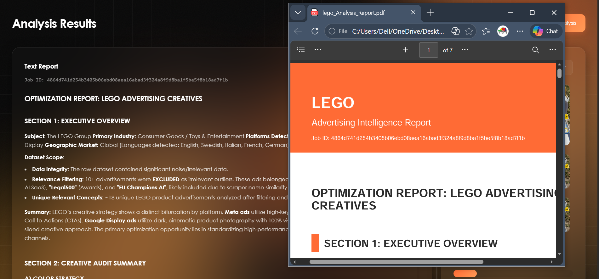

# AdSpy Intelligence 🕵️

> **Competitive ad intelligence platform** — input a competitor's name or URL, and receive an AI-generated report on their advertising strategy across Meta, LinkedIn, Reddit, and Google Ads.

Built for **Inbox Communications Inc.**, a Platinum HubSpot Solutions Partner based in Ottawa. Delivered by a 4-person team over 7 months (June–December 2025).

---

## 📌 What Is This?

AdSpy Intelligence automates the discovery, collection, and analysis of competitor digital advertising campaigns. A user submits a company name or domain URL through a minimal web interface; the system then scrapes public ad libraries, extracts structured metadata and creative assets, runs them through LLM-powered analysis pipelines, and produces a downloadable PDF report — all within approximately 6 minutes per query.

**Problem it solves:** Small marketing teams lack affordable, multi-platform tools for competitive ad intelligence. Manual tracking is slow, inconsistent, and impossible to scale. AdSpy replaces that manual effort with a fully automated, serverless pipeline.

---

## ✨ Key Features

- 🔍 **Multi-Platform Ad Scraping** — Collects public ads from Meta, LinkedIn, Reddit, and Google Ads Libraries (up to 100 ads per session, past 3 months)
- 🤖 **AI-Powered Analysis** — LLM-driven keyword extraction, tone classification (promotional / urgent / informative), and sentiment scoring (positive / neutral / negative)
- 🎨 **Visual Intelligence** — Detects color schemes, font styles, CTAs, logos, and inferred audience targeting from ad creatives
- 📄 **PDF Report Generation** — Automated competitor intelligence report with metadata, ad samples, and strategic insights
- ⚡ **Serverless Architecture** — AWS Lambda + API Gateway scales on demand; zero idle infrastructure costs
- 🔄 **Automated Workflows** — n8n pipelines orchestrate data ingestion, ETL, LLM prompting, and report assembly
- 📊 **React Dashboard** — Real-time progress tracking, image gallery, markdown report viewer, and in-browser PDF export
- 🗂️ **Job History Retrieval** — Re-access any previous analysis by Job ID

---

## 🖼️ Usage Flow

### 1. Search — Enter a competitor name or URL


### 2. Loading — Real-time pipeline progress


### 3. Results — Ad image gallery with metadata


### 4. Report — AI-generated competitive intelligence


### 5. Export — Download as PDF




---

## 🏗️ Architecture

```
┌──────────────────────────┐
│   React SPA (Vite + TS)  │  ← User submits company name or URL
└────────────┬─────────────┘
             │ HTTPS
             ▼
┌──────────────────────────┐
│  AWS API Gateway         │
│  + AWS Lambda (Python)   │  ← Validates input, routes jobs
└────────────┬─────────────┘
      ┌───────┴────────┐
      ▼                ▼
┌──────────┐    ┌─────────────────┐
│ Scraper  │    │  n8n Workflows  │  ← AI analysis & report generation
│ (Python) │    │  (LLM Pipelines)│
└────┬─────┘    └────────┬────────┘
     │                   │
     ▼                   ▼
┌──────────────────────────────────┐
│  AWS S3 (images, JSON, reports)  │
│  AWS DynamoDB (job state/status) │
└──────────────────────────────────┘
```

**Data flow:** User Input → API Gateway → Lambda → Scraper fetches ads → S3 stores assets → n8n runs LLM analysis → Report compiled → Frontend retrieves via presigned S3 URLs

---

## 🛠️ Tech Stack

| Layer | Technology |
|---|---|
| Frontend | React 18, TypeScript 5.6, Vite 5 |
| UI / Styling | Tailwind CSS, shadcn/ui, Radix UI, Framer Motion |
| State / Data | TanStack React Query, React Hook Form, Zod |
| PDF Export | jsPDF, html2canvas |
| Backend API | AWS Lambda (Python), AWS API Gateway |
| Automation | n8n (self-hosted, visual workflow orchestration) |
| AI / LLMs | LLM APIs via n8n (keyword extraction, tone, sentiment, visual analysis) |
| Storage | AWS S3 (images, reports, metadata), AWS DynamoDB (job records) |
| Scraping | Python (platform-specific modules per ad library) |
| Dev Tooling | ESBuild, PostCSS, Autoprefixer, ESLint |

---

## 🚀 Setup and Run

Follow these steps to set up and run the project:

1. Ensure APIs and n8n workflows are configured, up and running on AWS & n8n.
2. Create a `.env` file that contains the API URL:

```
VITE_LAMBDA_API_URL=https://YOUR-API

```

3. Make sure you are in the root folder of the project (`adspy_intelligence`).
4. Open Visual Studio Code and open the integrated terminal.
5. Run the following commands:

```
npm install
npm run dev


```

### Troubleshooting `npm install` Errors

If you encounter errors during `npm install`, try the following steps:

1. Close Visual Studio Code and re-open it as Administrator.
2. Open the terminal in VS Code and run:

```
Set-ExecutionPolicy -ExecutionPolicy RemoteSigned -Scope CurrentUser
```

3. Type Y when prompted.
4. Run the install commands again:

```
npm install
npm run dev
```

---

## 📐 Data Model

```
Company (1) ──< (N) Jobs
    │
    └──< (N) Ad Images (stored in S3)
              │
              └──< (1) Report per Job (stored in S3)
```

Job state is tracked in **DynamoDB**; images, metadata, and reports are stored in **S3** and retrieved via presigned URLs (1-hour expiration).

---

## 📄 Documentation

This project has approximately 200 pages of internal design documentation covering system architecture, API contracts, data schemas, n8n workflow design, testing strategy, deployment procedures, and maintenance guidance. Available upon request.